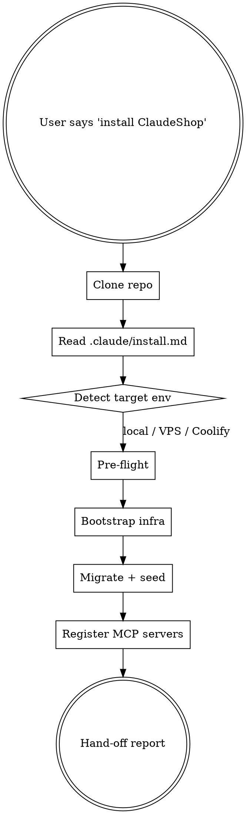

# Claudeshop-Install

> [!abstract] What this skill does
> Runs the ClaudeShop install playbook: clone → detect environment → pre-flight → infra → migrations → seed → register MCP servers → hand off. Every step is checkpointed so a long session can resume cleanly after a restart.

## When to invoke

Trigger this skill the moment the user says **any** of:

- `install https://github.com/Skill2Cochon/ClaudeShop.git`
- `deploy ClaudeShop to <env>`
- `set up ClaudeShop for me`
- `bootstrap a new ClaudeShop store`
- `clone and deploy the repo`
- `/install Skill2Cochon/ClaudeShop`
- Any prompt mentioning `ClaudeShop` + a verb from the set {install, deploy, bootstrap, setup, provision, clone}

If the user gives a bare URL pointing at this repo, match the skill too.

## Hard rules

1. **NEVER skip the pre-flight checklist** — the playbook at `.claude/install.md` has 6 phases; execute them in order.
2. **NEVER push secrets** — if the user hands you a key, refuse to write it outside `.env.local` (gitignored).
3. **ALWAYS use a worktree** if the repo is already cloned somewhere — `git worktree add` rather than a second clone.
4. **ALWAYS checkpoint** with `git commit -m "checkpoint: phase N complete"` after each phase so a session restart can resume.
5. **ALWAYS run `gitnexus_impact`** before editing any existing file — required by the repo's CLAUDE.md anti-patterns.
6. **NEVER deploy Couche-1 changes** (auth, payments, RLS policies) without explicit user confirmation + test evidence.

## Workflow



### Step 1 — Clone (if not already present)

```bash
git clone https://github.com/Skill2Cochon/ClaudeShop.git claudeshop
cd claudeshop
```

If the repo is already present as a worktree, use it.

### Step 2 — Read the full playbook

Read `.claude/install.md` top to bottom before executing any command. The file is the source of truth; this SKILL.md is the dispatcher.

### Step 3 — Detect target environment

Ask the user once (if not specified): **local dev**, **generic Docker host**, or **Coolify**? Default to local if truly ambiguous.

### Step 4 — Follow the playbook phases

Phases 1–6 in `.claude/install.md`. Do not merge phases; checkpoint between each. If a phase fails, surface the exact error, propose one fix, wait for confirmation.

### Step 5 — Register MCP servers

Read `.claude/mcp.json` and prompt the user to append each block to their Claude Code `settings.json`. Do not auto-write to `settings.json` without explicit OK.

### Step 6 — Deliver the hand-off

Follow the template in `.claude/install.md § 7 — Hand-off report`. Output includes:
- URLs (storefront / admin / API)
- First-login credentials (demo or freshly provisioned)
- Env-var checklist still pending
- Next action for the merchant (first product, first tenant, etc.)

## Red flags

| Thought | Reality |
|---------|---------|
| "I'll just `git clone && pnpm install && pnpm dev` — skip the playbook" | **Stop.** The playbook contains the env detection, the secret guards, the checkpoints. Shortcuts break merchant trust. |
| "User didn't confirm prod-vs-dev, assume prod" | Ask. Wrong assumption wipes volumes or exposes demo creds on the public internet. |
| "`.env.production` missing — I'll seed reasonable defaults" | Never. Refuse and ask the user to provide the secrets via their secret manager. |
| "SSRF/auth-guard fixes are nice-to-have for a demo" | `AUDIT.md` lists these as BLOCK-before-prod. Install for demo is fine; **do not deploy publicly without applying them.** |

## Reference

- Playbook :: `.claude/install.md`
- Manifest :: `.claude/install-manifest.json`
- MCP config :: `.claude/mcp.json`
- Security audit :: `AUDIT.md`
- Full project context :: `CLAUDE.md`
- Operator handbook :: `docs/handbook/getting-started.md`
